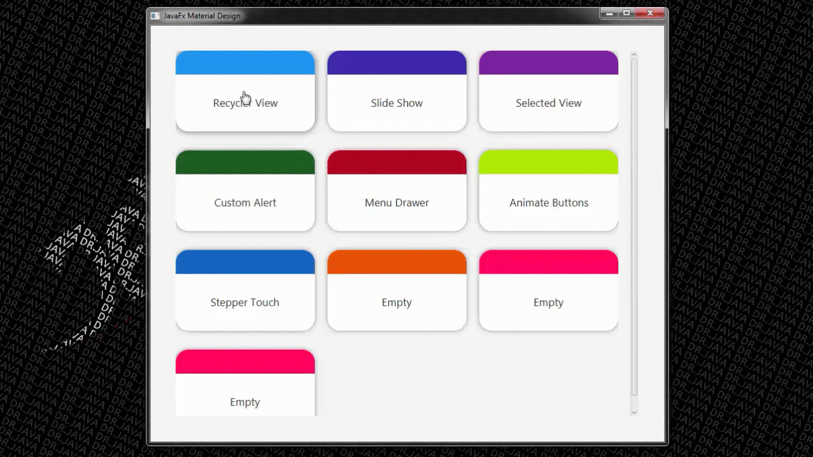
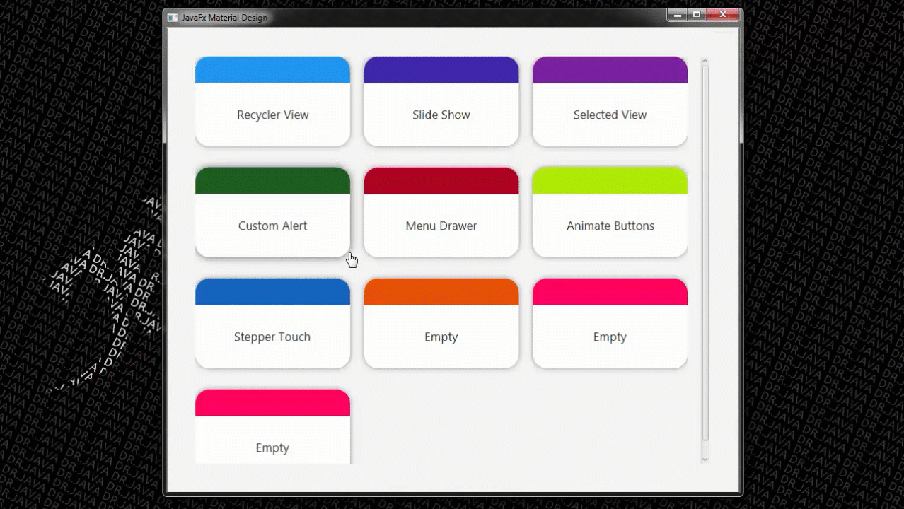

# JavaFX Meterial Design 🎉
JavaFX Material Design Models (UI/UX)

## Demo

<i>Stepper Touch</i>

       

<i>Recycler View</i>

       

<i>Selected View</i>

       

<i>Menu Drawer</i>

       

<i>Custom Alerts</i>

       

<i>Animate Buttons</i>

<i>Slide Show</i>

**Or [Watch video :movie_camera:](https://youtu.be/go6uRr54gP4)**
 
## Thank _You_!
Please :star: this repo and share it with others
 
## Libraries used 🔧
* JFoenix
* AnimateFX

## Installation 🔌
1. Press the **Fork** button (top right the page) to save copy of this project on your account.

2. Download the repository files (project) from the download section or clone this project by typing in the bash the following command:

       git clone https://github.com/HouariZegai/FXMaterialDesign.git
3. Import it in Intellij IDEA or any other Java IDE & let Maven download the libraries (mentioned above) for you.
4. Run the application :D

## Contributing 💡
If you want to contribute to this project and make it better with new ideas, your pull request is very welcomed.
If you find any issue just put it in the repository issue section, thank you.
